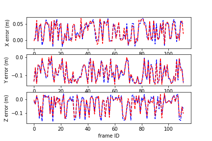

# VIO
Visual inertial odometry using stereo cameras.
Good starting point for visual inertial odometry.  
Tested dataset: large_loop_1, SLAM dataset, www.eth3d.net.
Unoptimized version: ~1.5% translation error, 20 frames/s 1 core Intel(R) Core(TM) i5-4200H CPU @ 2.80GHz, RAM 6GB

# Dependencies
- OpenCV
- Eigen

# Improvement with machine learning
In the figure below, blue line is the VIO's position estimation error, red line is the prediction of that error using a simple linear regression with 12 independent variables (corresponding to camera's egomotion and features' distribution). The regression is performed with 560 frames (where we have the groundtruth) using a 80-20 train-test split. There's a strong implication that machine learning can significantly improve VIO's position estimation without adding any computational burden.     

